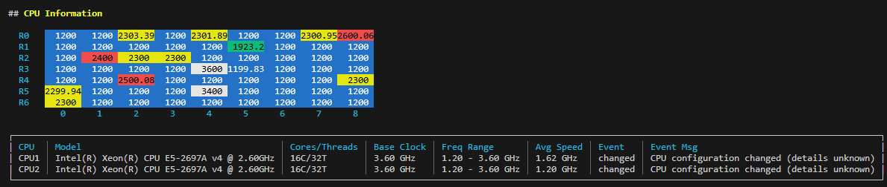
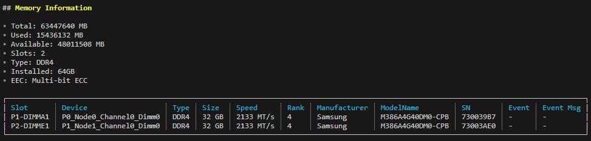
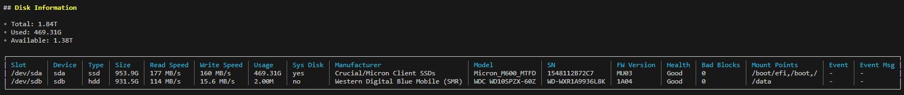
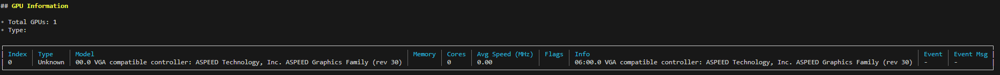
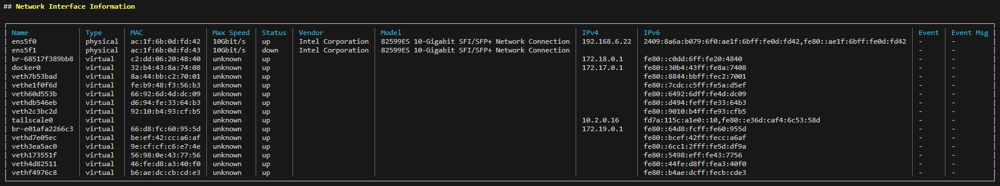
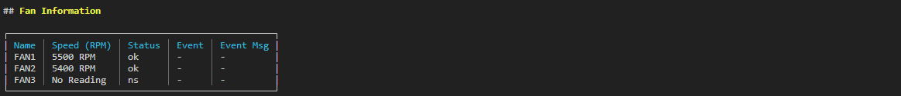

# SysInfoKeeper

[中文](./README_CN.md)

SysInfoKeeper is a hardware inventory and drift-detection CLI for Linux/Unix systems.  
Each run collects a full hardware snapshot (CPU, RAM, disk, NIC, GPU, fans, sensors), compares it to the history stored in SQLite, and labels devices as **added**, **removed**, **changed**, or **moved**. The CLI can render rich terminal tables, emit JSON/YAML, or act as a background daemon that continuously records hardware events.

---
CPU
<div style="flex: 1; text-align: center;">
  
</div>
MEM
<div style="flex: 1; text-align: center;">
  
</div>
DISK
<div style="flex: 1; text-align: center;">
  
</div>
GPU
<div style="flex: 1; text-align: center;">
  
</div>
NETCARD
<div style="flex: 1; text-align: center;">
  
</div>
FAN
<div style="flex: 1; text-align: center;">
  
</div>
## Feature Highlights

- **Accurate hardware discovery** – wraps `lsblk`, `udevadm`, `dmidecode`, `smartctl`, `findmnt`, `pterm`, and other helpers to build a normalized view of every component.
- **Disk benchmarking** – runs calibrated `dd` tests on real mount points (avoiding tmpfs) and stores read/write throughput alongside SMART data.
- **Event tracking** – snapshots live in SQLite; the comparator marks adds/removals/migrations and persists the timeline for later auditing.
- **Retention management** – history is kept for 30 days by default (configurable via `sinfo retention`); old events can be pruned automatically or on demand.
- **CLI & automation ready** – switchable outputs (`graph`, `table`, `json`, `json-line`, `yaml`), per-target collection, leveled detail (`basic` / `advanced` / `full`), and ready-to-run systemd service/appimage assets.

---

## Repository Layout

```
.
├── cmd/sinfo/            # Cobra CLI entrypoints (root, clean, retention, …)
├── core/                 # Hardware collectors, models, DB layer, comparator
│   ├── hardware/         # Snapshot manager, DB storage, scheduler
│   ├── model/            # Rendering helpers + JSON structs
│   └── packages/         # CPU / RAM / Disk / GPU / NIC collectors
├── deployments/          # Example systemd unit
├── tools/                # Call-graph visualizations, build helpers
├── LICENSE               # Dual-license policy (AGPLv3 + commercial)
├── LICENSE.AGPLv3        # Full AGPL text
└── LICENSE.COMMERCIAL    # Commercial terms summary
```

---

## Requirements

- Go 1.21+ (module mode)
- Standard Linux utilities: `lsblk`, `dmidecode`, `smartctl`, `udevadm`, `findmnt`, `dd`, `dhclient`
- Optional: `appimagetool` & MinIO client (`mc`) for packaging; Graphviz for regenerating call graphs

---

## Quick Start

### Method 1 · Run directly with `go run`

```bash
git clone https://github.com/binrchq/sysinfokeeper.git
cd sysinfokeeper

# Graph/table output in the terminal
go run ./cmd/sinfo --output graph

# JSON export (CI/CD, SIEM, etc.)
go run ./cmd/sinfo --output json > snapshot.json

# Track only disks and NICs at advanced verbosity
go run ./cmd/sinfo --target disk --target nic --level advanced
```

### Method 2 · Build a standalone binary

```bash
GO111MODULE=on go install binrc.com/sysinfokeeper/cmd/sinfo@latest
./sinfo --output table
```

The CLI stores every snapshot in `/var/lib/sysinfokeeper/hardware.db` by default. Subsequent runs automatically compare against the last snapshot and tag hardware events.

---

## Core Commands

| Command | Description |
|---------|-------------|
| `sinfo` | Collects hardware info, renders output, records snapshot. |
| `sinfo clean` | Cleans historical records (`--all`, `--inactive`, `--days`, `--type`, `--dry-run`). |
| `sinfo retention` | Shows or updates the retention window (default 30 days). |
| `sinfo --output json` | Machine-readable export. |
| `sinfo --target cpu --target memory` | Limit collection scope. |

For unattended environments, combine `sinfo` with cron/systemd timers or use the scheduler in `core/hardware/scheduler.go`.

---

## Example Output (JSON excerpt)

```json
{
  "cpu": {
    "cpu_infos": [
      {
        "model": "Intel(R) Xeon(R) CPU E5-2697A v4 @ 2.60GHz",
        "cores": 16,
        "avg_speed": "2.05 GHz",
        "event": "changed",
        "event_msg": "Configuration changed: Max Speed: 2.30 -> 2.60 GHz"
      }
    ]
  },
  "disk": {
    "disk_infos": [
      {
        "device": "sda",
        "size": "953.9G",
        "read_speed": "468 MB/s",
        "write_speed": "444 MB/s",
        "mount_point": ["/", "/boot"],
        "event": "-",
        "removed_at": null
      },
      {
        "device": "loop0",
        "event": "removed",
        "event_msg": "Disk removed: loop0 (50.8M)",
        "removed_at": "2024-01-01T12:00:00Z"
      }
    ]
  }
}
```

---

## Building & Packaging

```bash
# Standard Go binary (module path import)
go build binrc.com/sysinfokeeper/cmd/sinfo -o sinfo

# AppImage bundle (requires appimagetool + MinIO credentials)
make appimage

# Systemd deployment
sudo install -m644 deployments/sinfo.service /etc/systemd/system/sinfo.service
sudo systemctl enable --now sinfo
```

`build-appimage.sh` and `Makefile` capture the packaging pipeline used for releases.

---

## Running the `serve` scheduler as a systemd service

The CLI ships with a reference unit file at `deployments/sinfo.service`. Copy or adapt it to run the long‑lived `sinfo serve` scheduler:

```ini
[Unit]
Description=SysInfoKeeper Hardware Monitoring Service
After=network-online.target
Wants=network-online.target

[Service]
Type=simple
User=sysinfokeeper
Group=sysinfokeeper
WorkingDirectory=/var/lib/sysinfokeeper
Environment=SINFO_INTERVAL=3600
Environment=SINFO_RETENTION=30
Environment=SINFO_SPEED_TEST=low
EnvironmentFile=-/etc/sysinfokeeper.env
ExecStart=/usr/local/bin/sinfo serve \
  --interval $SINFO_INTERVAL \
  --retention $SINFO_RETENTION \
  --speed-test $SINFO_SPEED_TEST
Restart=on-failure

[Install]
WantedBy=multi-user.target
```

Customize the `Environment` values or override them via `/etc/sysinfokeeper.env`. The `serve` command respects these flags (`interval`, `retention`, `speed-test`) and keeps collecting snapshots until stopped.

---

## Contributing

1. Fork + clone the repository.
2. Enable Go modules (`GO111MODULE=on`).
3. Keep `gofmt`/`goimports` clean; run lint/tests before submitting PRs.
4. Describe hardware environments when reporting bugs (kernel, distro, storage topology, RAID, etc.).

Contributions remain under the same dual-license scheme (see below).

---

## License

SysInfoKeeper uses a dual-license model:

- **Open-source option** – [GNU AGPLv3](LICENSE.AGPLv3) for community and open deployments.
- **Commercial option** – [commercial license](LICENSE.COMMERCIAL) for closed-source, OEM, or SaaS use without copyleft requirements.

The [LICENSE](LICENSE) file explains how to pick the appropriate license and how to obtain commercial authorization. Unless you have a separate commercial agreement, contributions are accepted under the AGPLv3 terms.

For commercial licensing, email BinRC as described in `LICENSE.COMMERCIAL`.

---